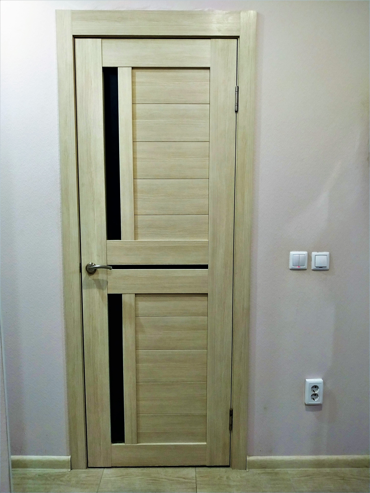
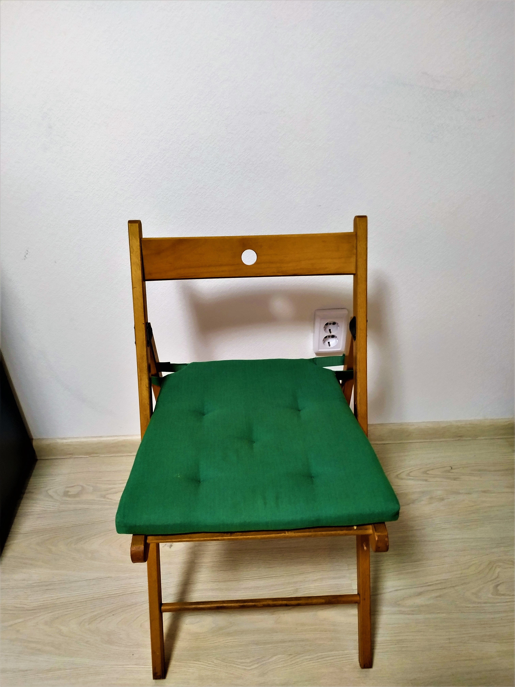

# SG_Big_Lab_SPBPU_2020

Курс Обработка сигналов на 4 курсе предполагает написание большой лабораторной по решению задачи с семантическим разрывом.

## 1. Постановка задачи
Имеется изображение, содержащее объект А и дверной проём Б. Требуется установить, пролезает ли объект А через дверной проём Б, если нести его так, как сфотографировано на изображении.
### 1.1. Вход
1. Объект А -- стул.
2. Дверной проём Б -- вход в ванную комнату.

*Данные*: фотографии стула в различных положениях на фоне дверного проёма как рядом с ним, так и в нем.

### 1.2. Выход
Одна из меток:

1. “yes” -- стул пролезает через дверной проём, если нести его так, как сфотографировано на изображении.
2. “no” -- стул не пролезает через дверной проём, если нести его так, как сфотографировано на изображении.
3. “undefined” -- на фото нет хотя бы одного из объекта (стула и/или дверного проёма), либо алгоритм не смог выбрать между метками “yes” и “no”.

### 1.3. Требования к изображению
1. Изображение снято на камеру не менее 3.1 Мп.
2. На изображении присутствуют и стул, и дверной проём. Стул должен быть на фото целиком. 
Дверной проём может быть изображен не целиком, а именно -- на изображении обязательно должны быть левая и правая границы дверного проёма, верхняя или нижняя границы не обязательны.
3. Изображение должно быть снято при хорошей освещённости.
4. Дальняя точка стула должна отстоять от плоскости дверного проёма не дальше, чем на 20 см.

## 2. План решения
Здесь представлен первоначальный план решения задачи.
1. Определение границ объектов на изображении.
    1. *Метод Canny*.
    Ищем методом Canny границы стула и дверного проёма. Вопрос в сложности отделения стула от дверного проема. Если стул и дверной проём не пересекаются, то отделить друг от друга видится достаточно простым. Если же они пересекаются, то это должно быть сложнее.
    2. *Преобразование Хафа*.
    Ищем прямые на изображении. Кажется, этот алгоритм должен хорошо подойти для данной задачи, так как дверной проём и стул состоят преимущественно из прямых линий. Дверной проём – это 2, 3 или 4 прямых. Стул – это, конечно гораздо большее количество прямых, но всё же это прямые, а не волнистые линии.
    3. Дверной проём и стул отличаются по цвету. Можно попробовать какие-то цветовые фильтры.
2. Определение найденных объектов.
Нашли какие-то границы чего-то. Необходимо определить, что это за объект. 
    1. *Сопоставление с шаблонов*.
    Необходимо как-то получить эти шаблоны. Разметить вручную контура.
3. Геометрия
Необходимо определить, пролезает ли стул в дверной проём. Стул может быть в дверном проеме целиком или быть рядом с дверным проемом и не пересекать его вообще. 
Поэтому метод «если границы найденных объектов не пересекаются, то проходит; иначе – нет» - не есть хорошо. Можно применить этот метод для самой первой реализации, чтобы алгоритм решения выдавал хоть какой-нибудь не рандомный ответ.
Необходимо определять ширину дверного проёма (причем надо учесть, что дверь на изображении может быть повернута на некоторый угол). И исходя из взаимного расположения, ширину стула. Конечно, будем считать, что по высоте стул точно пролезает в дверь (то есть у нас обыкновенная дверь, а не из «Алисы в стране чудес», и стул не для вымышленных великанов).
Я предполагаю, что в результате будут получены два числа – ширина дверного проема и ширина стула. И если ширина стула меньше ширины дверного проема, то стул проходит. Иначе – нет.
## 3. Первая итерация
На первой итерации решения был представлен следующий алгоритм:
### 3.1. Алгоритм
1. Создаём щаблоны стула и двери по следующим фотографиям:

2. По этим шаблонам на изображении ищем стул и дверь с помощью гомографии.
3. Избавляемся от перспективы на фотографии.
4. Находим ширину прямоугольника `chair_non_perspective_border.get_width()`, описывающего стул.
5. Находим ширину прямоугольника `door_non_perspective_border.get_width()`, описывающего дверь.
6. Если `door_non_perspective_border.get_width() > chair_non_perspective_border.get_width()`, 
то стул проходит через дверь. Иначе – не проходит.
### 3.2. Ревью
На ревью большинство замечаний было к стилю кодирования на Python, что не удивительно, так как в программировании на Python я еще не сильна.
## 4. Вторая итерация
### 4.1. Алгоритм
### 4.2. Ревью

## 5. Итоги

## 6. Персоны
* Разработчик - Митрофанова Алина
* Преподаватель - Кацман Виктор
* Ревьюеры - Нахатович Михаил, Титова Ольга, Денисов Павел, Триногин Андрей